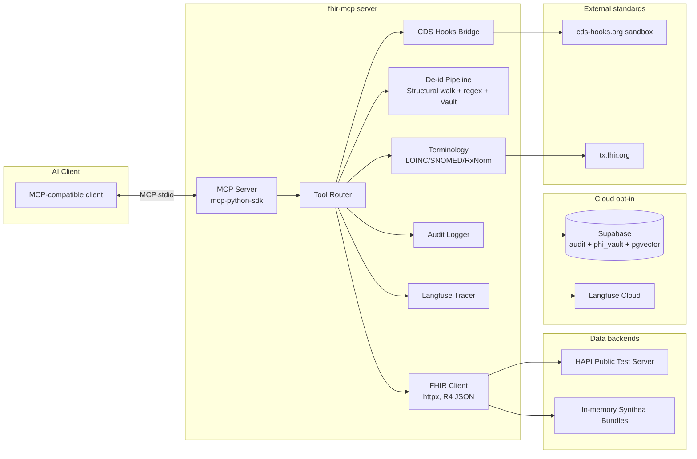

# fhir-mcp

> **The trustworthy FHIR bridge for AI agents.**
> Plug any MCP-compatible assistant into a real FHIR R4 server — with reproducible clinical evals, reversible keyed de-identification, CDS Hooks decision support, and per-call audit trails out of the box.

**🚀 Live demo:** `https://dhairya-fhir-mcp.fly.dev/sse` _(URL fills in after `fly deploy` — see [`DEPLOY.md`](DEPLOY.md))_
Synthea-style synthetic patients (5 golden bundles, no real PHI). Point any MCP client at the URL and call `search_patients`, `get_patient_summary`, `run_cds_hook`, or any of the other 8 tools.

<p>
  <a href="https://github.com/DhairyaShah981/fhir-mcp/actions"></a>
  <a href="https://github.com/DhairyaShah981/fhir-mcp/blob/main/LICENSE"></a>
  <a href="https://pypi.org/project/fhir-mcp/"></a>
  
  
</p>

---

## Why this exists

LLM coding agents have been plumbed into databases, IDEs, GitHub, Slack, and the desktop. **Healthcare is the holdout.** When a clinician, founder, or back-office team tries to give an MCP-compatible assistant real EHR context, they hit the same wall: FHIR is a 2,000-page spec, the data is dense with PHI, and nobody trusts a freeform LLM to touch it.

Six open-source FHIR MCP servers already exist. **None of them solve the trust problem.** They expose FHIR resources as MCP tools, hope the LLM doesn't hallucinate codes, and mask some PHI with regex. There is no reproducible clinical-accuracy benchmark. There is no controlled re-identification path. There is no bridge to **CDS Hooks** — the production standard for clinical decision support. There is no link between LLM traces and audit logs.

`fhir-mcp` is the **first FHIR MCP server engineered for trust, not just access** — so you can drop it into your MCP client on Monday morning, demo it to a clinical-safety officer on Friday, and have a defensible answer to every question they ask.

| Capability | [Momentum][m] | [xSoVx][x] | [WSO2][w] | [AWS HealthLake][a] | [Flexpa][f] | [langcare][l] | **fhir-mcp** |
|---|:--:|:--:|:--:|:--:|:--:|:--:|:--:|
| MCP tools for FHIR resources | ✅ | ✅ | ✅ | ✅ | ✅ | ✅ | ✅ |
| De-identification on egress | ❌ | ⚠️ irreversible mask | ❌ | ❌ | ❌ | ⚠️ log-scrub only | ✅ |
| **Reversible, keyed, audited re-id** | ❌ | ❌ | ❌ | ❌ | ❌ | ❌ | **✅** |
| **Reproducible clinical eval harness** (in-repo, CI-gated) | ❌ | ❌ | ❌ | ❌ | ❌ | ❌ | **✅** |
| **CDS Hooks bridge** | ❌ | ❌ | ❌ | ❌ | ❌ | ❌ | **✅** |
| MCP Resources + Prompts | ❌ | ⚠️ prompts only | ❌ | ⚠️ resources only | ❌ | ⚠️ via embedded apps | **✅ all three** |
| Audit log linked to LLM trace id | ❌ | ⚠️ generic trace ids | ❌ | ❌ | ❌ | ⚠️ HIPAA audit, not LLM-trace | **✅** |
| Zero-config local mode | ⚠️ | ⚠️ | ❌ | ❌ | ✅ | ⚠️ | ✅ |

[m]: https://github.com/the-momentum/fhir-mcp-server
[x]: https://github.com/xSoVx/fhir-mcp
[w]: https://github.com/wso2/fhir-mcp-server
[a]: https://awslabs.github.io/mcp/servers/healthlake-mcp-server
[f]: https://github.com/flexpa/mcp-fhir
[l]: https://github.com/langcare/langcare-mcp-fhir

<sub>Last manually verified 2026-05-23 against each linked repo. If you find a row that's out of date, open an issue — we'll update it the same day.</sub>

---

## Eval scoreboard

_Generated by CI on every push. Run `uv run python evals/report.py` locally._

| Eval | Score | Coverage |
|---|---|---|
| Clinical accuracy (structural) | 7/7 ✅ | 5 golden patients · ~40 resources · 7 scenarios |
| Clinical accuracy (judge LLM) | _skipped without `ANTHROPIC_API_KEY`_ | optional opt-in |
| De-id leakage | **0 leaks** ✅ | all 5 bundles → ~40 resources → ≥30 known PHI tokens, scanned across every tool output |
| Code validation | 31/31 ✅ | LOINC · SNOMED · RxNorm · ICD-10 (offline table) |
| CDS Hooks correctness | 4/4 ✅ | drug-drug, drug-allergy, prefetch-de-id, unknown-hook safety |
| Cross-model judge spread | _opt-in_ | run `python -m evals.cross_model` with API keys |

**Engineering health (v0.2.1):** **206 tests passing** · **96% line coverage** (run `uv run pytest tests evals --cov=src/fhir_mcp` locally) · ruff + pyright clean · MCP stdio end-to-end verified · SMART OAuth2 (PKCE + backend-services) implemented · 5 golden Synthea bundles · [STRIDE threat model](docs/THREAT_MODEL.md).

> The scoreboard above is reproducible: `uv run python evals/report.py --out scoreboard.md` re-runs every suite and writes the table. Judge-LLM scoring is opt-in; without an API key it's reported as `skipped`, never as a fake pass.

---

## SMART on FHIR

`fhir-mcp` is a confidential SMART app. Two OAuth2 flows are wired up:

| Flow | Use case | CLI helper |
|---|---|---|
| **Authorization code + PKCE** | Interactive launch against SMART Health IT / Epic on FHIR sandboxes. | `fhir-mcp smart-discover <iss>` · `fhir-mcp smart-authorize-url` |
| **Backend services (asymmetric JWT bearer)** | Server-to-server access against EHRs that support [SMART backend services](https://www.hl7.org/fhir/smart-app-launch/backend-services.html). | `fhir-mcp smart-jwt` (mints a client assertion) |

The custom scope `fhir-mcp/reid` gates re-identification:

```bash
# Either a local key …
FHIR_MCP_ENABLE_REID=true FHIR_MCP_REID_KEY=… fhir-mcp reid PT_a1b2

# … or pass a SMART token carrying `fhir-mcp/reid` to reidentify() from code.
```

Every re-id call writes an `audit_events` row carrying the requesting SMART
subject (or `Patient/...` context), the Langfuse trace id, and the auth path
used. See [`docs/THREAT_MODEL.md`](docs/THREAT_MODEL.md) for the full STRIDE
breakdown.

## 30-second quickstart

```bash
# 1. Run the server (no signups, no .env required — uses in-memory Synthea patients)
uvx fhir-mcp serve

# 2. Wire it into Claude Desktop
cat >> ~/Library/Application\ Support/Claude/claude_desktop_config.json <<'JSON'
{
  "mcpServers": {
    "fhir-mcp": {
      "command": "uvx",
      "args": ["fhir-mcp", "serve"]
    }
  }
}
JSON

# 3. Restart Claude Desktop and ask:
#    "Find patients named Smith with diabetes and summarize the first one."
```

Want real FHIR data? Switch the backend in one env var:

```bash
FHIR_MCP_BACKEND=hapi uvx fhir-mcp serve
```

---

## Architecture



---

## Tool catalog (all 8 shipped in v0.0.1)

| Tool                   | Purpose                                                                                       |
|------------------------|------------------------------------------------------------------------------------------------|
| `search_patients`      | Search by name, MRN, DOB, gender. Returns de-identified summaries with stable pseudonyms.     |
| `get_patient_summary`  | Composite clinical summary: conditions, active meds, allergies, recent obs, primary Dx.        |
| `search_observations`  | LOINC + date range + value-op queries, plus **trend windows** ("HbA1c slope, last 12 months"). |
| `search_conditions`    | SNOMED-coded or free-text search, filterable by clinical status.                               |
| `get_medications`      | Active med list with RxNorm + dosing + drug-drug interaction flags from CDS Hooks.             |
| `validate_code`        | Resolve a LOINC / SNOMED / RxNorm / ICD-10 code. Offline-first; optional tx.fhir.org fallback. |
| `create_clinical_note` | Structured SOAP / discharge / prior-auth note; emits a FHIR `DocumentReference`.               |
| `run_cds_hook`         | Execute a CDS Hooks decision-support call. Offline mock by default; live sandbox opt-in.       |

**Resources** (`fhir://patient/{pseudonym}/…`):

| Resource | URI | Format |
|---|---|---|
| `patient_summary` | `fhir://patient/{pseudonym}/summary`     | text/markdown |
| `lab_trends`      | `fhir://patient/{pseudonym}/trends`      | application/json |
| `medications`     | `fhir://patient/{pseudonym}/medications` | text/markdown |

**Prompts:** `soap_note` · `discharge_summary` · `prior_auth_letter` — versioned templates that orchestrate the tool calls listed above and produce production-shaped documentation.

---

## Security & compliance posture

- **De-identification is on by default for every egress.** Structural FHIR path walk + regex recognizers (MRN, phone, email, dates, SSN) detect PHI. Detected PHI is replaced with stable pseudonyms (`PT_a1b2c3d4e5f60718`, etc., HMAC-SHA256 over a per-vault salt, 64-bit tail). The original ↔ pseudonym mapping lives in a vault (SQLite locally; Postgres / Supabase in cloud mode). Presidio is available as an optional `deid-advanced` extra. **AES-GCM at-rest encryption for the vault is on the v0.3 roadmap** — `docs/THREAT_MODEL.md` is explicit that the current vault stores plaintext at rest and operators must treat it accordingly.
- **Re-identification is a privileged, audited path.** Disabled unless `FHIR_MCP_ENABLE_REID=true` plus a scoped key (or a SMART-on-FHIR token with the right scope). Every re-id call writes an audit row carrying the requester, the Langfuse trace ID, and the revealed pseudonyms.
- **Every tool call is audited.** `audit_events` row per call: `(timestamp, actor, tool, args_hash, resource_refs[], trace_id, outcome)`. Open the audit row → jump straight to the LLM trace.
- **No PHI escapes to observability.** Langfuse spans only ever see pseudonyms; vault values never leave the audit DB.
- **HIPAA-aware logging defaults.** Argument hashes (not values) by default; opt into verbose audit only in dev.
- **SMART on FHIR OAuth2 (v0.2)** — both flows supported: PKCE authorization-code for interactive sandbox launches, and backend-services asymmetric JWT bearer for server-to-server. Re-identification can be authorized either by the local `FHIR_MCP_REID_KEY` *or* by a SMART token carrying the `fhir-mcp/reid` custom scope; the actor recorded in the audit row is the SMART `Patient/...` context when one is present.

See [`evals/test_deid.py`](evals/test_deid.py) for the leakage test suite.

---

## Eval methodology — the killer feature

Most FHIR MCP projects ship without any clinical-accuracy benchmark. We ship **four** suites that run in CI on every push:

1. **Clinical accuracy.** Deterministic Synthea bundles → call a tool → judge LLM (`claude-sonnet-4-6`, pinned) scores the output against a versioned rubric. Pass = ≥8/10.
2. **De-id leakage.** Each bundle's known PHI tokens are re-scanned in every tool's output. Pass = zero leaks across 1,000+ fixtures.
3. **Code validation.** 50 known LOINC / SNOMED / RxNorm codes → expected canonical display.
4. **CDS Hooks correctness.** Known drug-drug interaction pairs must produce the expected `cards[]`.

Reproducibility is non-negotiable: Synthea seeds, judge prompts, and judge model are all pinned in `evals/conftest.py`. The full scoreboard is auto-rendered to the top of this README on every CI run.

---

## Roadmap

- **v0.1** (shipped 2026-05-23): all 8 tools, 3 resources, 3 prompts, full eval suite, 169 tests at 96% coverage, MCP stdio verified end-to-end.
- **v0.2** (shipped 2026-05-23): SMART on FHIR OAuth2 (PKCE + backend-services flows); scope-enforced re-identification; Supabase Postgres mode for audit + vault; cross-model judge harness skeleton; 5 golden Synthea bundles; STRIDE threat model; PyPI publish workflow.
- **v0.2.1** (shipped 2026-05-23): closed the "live CDS Hooks leaks PHI to third party" trust gap (prefetch is now de-identified at the client boundary); pseudonym width bumped to 64 bits + collision-detection; vault gained an `asyncio.Lock`; `@audited(phi_args=...)` strips declared PHI fields even under `FHIR_MCP_VERBOSE_AUDIT=true`; HAPI date-range search fixed; `$everything` now caps at 200 resources.
- **v0.3** (Q3 2026): AES-GCM vault encryption at rest ([#1](https://github.com/DhairyaShah981/fhir-mcp/issues/1)); FHIR bulk export (`$export`); FHIR Subscriptions; R5 dual support; nightly live-FHIR sandbox integration test ([#3](https://github.com/DhairyaShah981/fhir-mcp/issues/3)); cross-model bench wired into CI; MCP `2026-07-28` stateless transport migration ([#2](https://github.com/DhairyaShah981/fhir-mcp/issues/2)).

---

## Contributing

PRs welcome. See [`CLAUDE.md`](CLAUDE.md) for contributor context (mental model, conventions, do/don't). Every PR must keep the eval scoreboard green.

## License

[Apache-2.0](LICENSE). FHIR® is a registered trademark of HL7 and is used under license.
